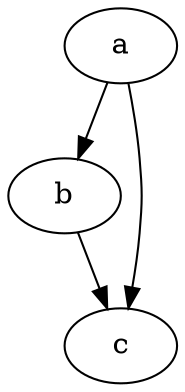

# @hpprc/gatsby-theme-blog-core

## Post example

````markdown

---
<!-- frontmatter form should be the same as below. -->
slug: example
date: 2019-11-08T14:49:23.467Z
title: This is example
tags:
  - react
  - gatsby
  - ssr
  - example
cover: ../assets/test1.jpg
---
<!-- cover image path must be relative path -->


<!-- you can code like this with code highliting -->
# this is example

```javascript{1,5-8}:title=gatsby-config.js
plugins: [
  {
    resolve: `gatsby-transformer-remark`,
    options: {
      plugins: [`gatsby-remark-prismjs`]
    }
  }
];
```


<!-- you can write graph -->


# Look at this Video:

<!-- You can write formulas like TEX formation -->
$
f(x) = \int_{-\infty}^\infty\hat f(\xi)\,e^{2 \pi i \xi x}\,d\xi
$

Lorem ipsum dolor sit amet, consectetur adipiscing elit, sed do eiusmod tempor incididunt ut labore et dolore magna aliqua. Ut enim ad minim veniam, quis nostrud exercitation ullamco laboris nisi ut aliquip ex ea commodo consequat. Duis aute irure dolor in reprehenderit in voluptate velit esse cillum dolore eu fugiat nulla pariatur. Excepteur sint occaecat cupidatat non proident, sunt in culpa qui officia deserunt mollit anim id est laborum.


````